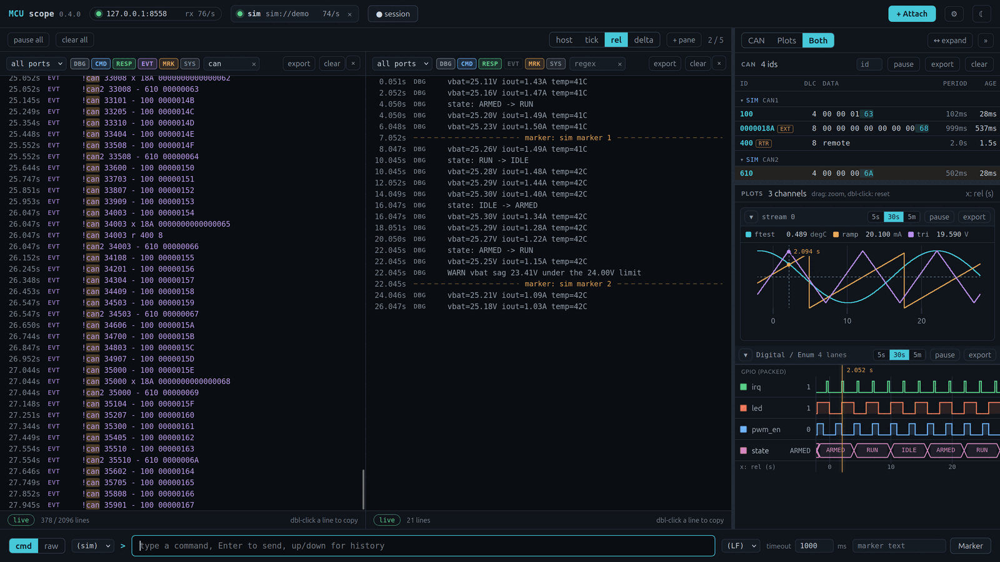

# MCUscope

[](https://github.com/dwatman/mcuscope/actions/workflows/ci.yml) [](https://pypi.org/project/mcuscope/) [](https://pypi.org/project/mcuscope/)

**MCUscope** is a hardware debug bridge for embedded targets.
A daemon owns the serial link to your MCU, timestamps every line into SQLite, and serves a web UI and a local API.
On top of that, both you and AI agents (such as Claude Code) can send CAN/I2C/SPI/GPIO/ADC commands, stream and query debug output, plot realtime data, and run send-and-wait-for-response interactions with timeouts.

Works identically on Linux and Windows 10/11.



*The zero-hardware demo (`mcuscoped --sim`): live terminal, decoded CAN table, and realtime plots in one frame.*

## How it works

```
your MCU
  firmware + monitor module
      |
      |  UART: plain text lines, one protocol
      v
mcuscoped daemon (this package)
  owns the serial port
  timestamps everything into SQLite
      |
      |  REST + WebSocket API on 127.0.0.1:8765
      |
      +--->  web UI      terminal, port setup, CAN view, realtime plots
      +--->  mcu CLI     same features from the shell; the AI agent interface
```

- The daemon (`mcuscoped`) is the **sole owner of the serial port**. Everything else is a client over the local API, so there is no "port busy", and capture continues even with no client attached.
- The wire protocol is **line-oriented text** sharing the UART with your normal debug prints.
  Machine traffic is tagged with leading characters (`>` command, `<` response, `!` event); everything else is treated as debug output.
  Sequence numbers correlate commands with responses.
- All traffic lands timestamped in **SQLite**, so "the last 20 CAN frames with id 0x1A3" or "debug lines matching X in the past 2 seconds" are cheap queries, not scrollback archaeology.
- The daemon captures debug output from **any** line-based firmware as-is; the command/response and plotting features need the small C monitor module linked into your firmware.

## What your firmware has to send

Nothing, to start with.
The three tiers below are additive: begin at the top, stop wherever the value runs out.

### Tier 1: plain text, no firmware changes at all

Any line-based output already works.
Keep your existing `printf` and change nothing:

```c
printf("boot ok, vbat=3.72V\n");
```

MCUscope timestamps every line, stores it in SQLite, and gives you the live terminal with per-pane filters, regex search over the whole capture, sessions, `mcu wait`, `mcu assert` and export.
That is a strictly better serial terminal, with nothing linked into your build.

The only rule: **debug lines must not begin with `<` or `!`**, which are reserved for the monitor protocol.
Everything else is passed through untouched as debug output.

### Tier 2: realtime plots, still just `printf`

One extra line format turns numbers into live strip charts.
No library, no linking, no allocation, no float `printf`: hard-code it wherever you need it.

```c
printf("!p %lu temp=%d.%02d rpm=%d\n", tick_ms, whole, frac, rpm);
```

The format is `!p <tick> <name>=<value> ...`, where `<tick>` is any millisecond counter.
Each value is an integer, a fixed-point number (`-12.34`), or scientific notation (`1.2e-05`, which is what `%g` prints if you do have float `printf`).
Format the fraction yourself and you never need `%f`.
Each name becomes a channel in the Plots panel, in `mcu plot channels`, and in `mcu plot export`.
The same channels can stream live to [PlotJuggler](https://github.com/PlotJuggler/PlotJuggler) over UDP (`mcu pj on`, or the settings page): add a "UDP Server" data source there with protocol JSON and timestamp field `ts`.

**Markers** annotate the timeline, and are just as cheap:

```c
printf("!m @%lu calibration start\n", tick_ms);
printf("!m boot done\n");                        // no timebase? omit the tick
```

They draw as a full-width divider in the terminal, alongside `mcu mark 'text'` and the marker box in the web UI.
The tick is optional but carries a literal `@`, so marker text that starts with a number (`!m 12 cells balanced`) keeps its first word.

### Tier 3: the monitor module, for talking back

Tiers 1 and 2 are one-way.
To have the host *ask* your firmware for something, add the portable C monitor module from `firmware/monitor/` (SPEC section 5, C99, no allocation, no HAL dependency).

That is what buys you:

- **Commands and responses**: `mcu cmd 'i2c rd 48 2'`, with sequence numbers, error codes and timeouts, plus the `can`/`i2c`/`spi`/`gpio`/`adc` subcommands.
- **CAN frames** in the decoded CAN table, with software filtering.
- **Typed plot streams** (`!pd`/`!ps`): compact binary-ish samples that carry real floats without float `printf`, and declare their own units and scaling once.
- **Digital and enum lanes**: logic-analyser bit traces and labelled state bands, sharing the plot time base.
- **Markers in one call**: `monitor_mark("calibration start")` fills the tick from your port for you.

See `firmware/monitor/INTEGRATION.md`; you wire up two shim functions (UART read/write) and a millisecond tick.

## Install

Python 3.11 or newer is required; every other dependency is pulled in for you.
This puts `mcuscoped` (the daemon), `mcu` (the CLI), and `mcu-sim` (the demo simulator) on your PATH in an isolated environment:

```bash
uv tool install mcuscope        # or: pipx install mcuscope
```

On Windows, `uv tool install` builds the tool around whichever `python` it finds first, which on a machine with KiCad, GIMP or Blender can be a vendored interpreter unsuited to a console daemon.
If `mcuscoped` starts silently or prints an interpreter warning, pin a real Python instead:

```powershell
uv tool install mcuscope --python 3.12 --force
```

No `uv` or `pipx` yet?
Either will do, though `uv` can also install Python itself:

```bash
curl -LsSf https://astral.sh/uv/install.sh | sh              # Linux
powershell -c "irm https://astral.sh/uv/install.ps1 | iex"   # Windows
```

If `python -V` reports anything older than 3.11 (or there is no `python` at all, which is common on Windows without the `py` launcher), let `uv` fetch one:

```bash
uv python install 3.12
```

Windows users: run the examples below from **PowerShell**.
They quote arguments with single quotes (`mcu cmd 'i2c scan'`), which PowerShell understands and `cmd.exe` does not.

Talking to a real board needs one more thing, depending on your OS:

- **Linux**: your user must be in the `dialout` group for serial access: `sudo usermod -aG dialout $USER`, then log out and back in.
- **Windows 10/11**: most USB-serial adapters and ST-Link VCPs work with the in-box driver; some need the vendor driver (CP210x, CH340, FTDI).

Neither is needed for the [hardware-free demo](#no-hardware-try-the-demo).
For a development setup (editable install with test/lint deps), see [Development](#development).

## Get running with a real board

### 1. Optionally, put the monitor in your firmware

This step is not required to start capturing, and not required to plot: see [What your firmware has to send](#what-your-firmware-has-to-send).
Add the portable C monitor module from `firmware/monitor/` when you want the host to be able to *ask your firmware for something*.
You wire its two shim functions to a UART (see `firmware/monitor/INTEGRATION.md`; an STM32 example is included).
It is a few files of dependency-free C99 that parse commands and format responses; your existing `printf` debug output keeps working alongside it.

Skip it and you still get timestamped capture, filtering, search, sessions and `!p` plots.
What waits for the monitor is commands and responses, decoded CAN, and the typed/digital streams.

### 2. Start the daemon and open the UI

```bash
mcuscoped                        # or `mcu daemon start` to run it in the background
```

Open **http://127.0.0.1:8765/ui/** (the daemon prints this URL; add `--open` to launch the browser automatically).

### 3. Attach your serial port

In the UI, click **+ Attach**: it lists detected serial devices with their descriptions.
Pick one, set the baud, give it an alias, and optionally tick "Save to config" so it reattaches on every daemon start.
From then on everything is live: the terminal streams, the CAN table decodes, plots draw.

The same attach works from the CLI, and `mcu devices` is how you find the port name in the first place:

```bash
mcu devices                                             # list host serial devices
mcu attach /dev/ttyACM0 --baud 115200 --alias board     # Linux
mcu attach COM7 --baud 115200 --alias board             # Windows
mcu ports                                               # what is attached right now
```

On Linux, `/dev/serial/by-id/usb-...` names stay stable across replugs; serial access needs the `dialout` group membership from [Install](#install).

The daemon reconnects automatically with backoff, so unplugging and replugging the device resumes capture with no restart (a disconnected port chip in the UI also offers a "reconnect now" button).
For a port that stays identified across reboots and re-enumeration, prefer `serial_number` in the config (see [Configuration](#configuration)).

### The web UI

Everything is controlled from the browser once the daemon runs:

- **Terminal**: live scrollback with per-pane port/channel/regex filters, pause, markers, and multiple panes side by side.
- **Setup bar**: attach/detach ports, connection health, daemon status.
- **CAN view**: a classic latest-per-id table with counts, periods, and ages, plus CSV export.
- **Plots**: realtime strip charts for `!p`/`!ps` data streams, and a digital/enum panel (logic-analyser bit traces and labelled state bands) sharing one time base and cursor with the analog charts.
  CSV export per chart.
- **Settings** (gear icon): bind address, storage path, retention, recorded sessions (export or delete), saved ports, access token. It writes the normal config file, which stays hand-editable.

### From the shell

The same things from a terminal, for when the browser is not where you are working:

```bash
mcu tail -f                              # follow live capture (add --chan/--match to filter)
mcu cmd 'i2c scan'                       # send a monitor command, print the response
mcu send 'custom line'                   # write one raw line, no response wait
mcu mark 'starting rail test'            # drop an annotation into the capture
mcu log export --last-ms 60000 -o run.log   # dump matching lines to a file
```

`mcu --help` lists the rest; every bus family (`can`, `i2c`, `spi`, `gpio`, `adc`) has its own subcommands.

## How an AI talks to it

The **`mcu` CLI is the AI interface**: an agent that can run shell commands can drive the hardware with no MCP server or SDK involved, and the human uses the exact same commands.
Two contracts make it agent-friendly:

- `--json` on any command prints exactly one machine-readable JSON object.
- Meaningful exit codes: **0** success/match, **1** error or bad usage, **2** timeout, **3** daemon unreachable.

```bash
mcu status                                   # daemon + port health
mcu cmd 'i2c rd 48 2' --json                 # send a command, get the response as JSON
mcu lines --chan debug --last-ms 2000        # query recent captured output
mcu can dump -n 20 --id 1A3                  # recent decoded CAN frames
mcu wait --match 'BOOT OK' --send 'reset' --timeout 5000   # the agent primitive:
                                             # send, then block until a matching line or timeout
```

Because the daemon stores everything, the agent can act, then *query what happened* (across debug prints, responses, and CAN traffic) instead of trying to keep a terminal open.

**Sessions** name a span of the capture, so one run can be pulled back out of a long-running log:

```bash
mcu session start boot-test --note 'cold start, 3V3 rail'
# ... run the test ...
mcu session stop
mcu lines --session boot-test --json          # only that run's lines
mcu plot export --session boot-test --names vbat -o run.csv
mcu session list                              # recent runs, with line counts
```

Starting and stopping a session drop marker lines into the capture, so the boundaries are visible in the terminal too, and the web UI has a one-click record button for the same thing.

The daemon also records a session for each of its own runs (`auto_session`, on by default), named `auto-<timestamp>`.
Naming a run displaces the automatic one and hands back to a fresh one when you stop; an automatic run that captured no device traffic is dropped rather than cluttering the list.

**Verdicts** turn a capture into a pass/fail answer, so an agent (or a CI job) can branch on an exit code instead of reading the log:

```bash
mcu assert --session boot-test --expect 'CALIB DONE' --forbid 'ERR|retry'   # judge a stored run
mcu assert --send reset --expect 'BOOT OK' --forbid 'PANIC' --timeout 5000  # judge a live window
```

Where `wait` asks "did this line appear?", `assert` asks "did this run pass?": several conditions at once, negative conditions included, one verdict.
Exit 0 is a pass and 1 is a fail.

**Archiving and deleting.** A run can be pulled out as a standalone capture database, and one that turned out to be useless can go without waiting for retention:

```bash
mcu session export boot-test -o boot-test.db   # a normal capture file: same schema, same queries
mcu purge --session junk-run --dry-run         # see how many lines would go
mcu purge --session junk-run --yes             # delete them (not recoverable)
mcu purge --before-days 2 --yes                # or by age, or --id-from/--id-to, or --all
```

The web UI lists recorded sessions under Settings with the same export and delete buttons.

To set an agent up:

- `mcu ai-guide` prints a compact, agent-oriented cheat sheet of the whole CLI.
- `docs/CLAUDE_SNIPPET.md` is a paste-in block for your project's `CLAUDE.md` that tells Claude Code the bridge exists and how to use it.

## No hardware? Try the demo

The bundled simulator speaks the full protocol, so the whole stack runs with nothing plugged in:

```bash
mcuscoped --sim --open           # daemon + simulator, opens the web UI
```

You get a live terminal, a ticking CAN heartbeat, realtime plots and digital lanes, and a working command box (`ping`, `i2c scan`, `i2c rd 48 2`).
This is purely for demoing and development; with a real board you never need it.
The simulator also runs standalone as `mcu-sim` (prints `socket://127.0.0.1:9900`, attachable like any device), which is how the test suite exercises the stack.

## Configuration

Config is optional: an absent file yields defaults with no ports, and the UI settings page can create it from scratch.
It lives at `platformdirs.user_config_dir("mcuscope")/config.toml`:

- **Linux**: `~/.config/mcuscope/config.toml`
- **Windows**: `%LOCALAPPDATA%\mcuscope\mcuscope\config.toml`

```toml
[server]
host = "127.0.0.1"      # bind "0.0.0.0" to reach the daemon across the LAN
port = 8765

[storage]
db_path = ""            # default: <user_data_dir>/mcuscope/capture.db
retention_days = 10
min_sessions = 5        # the newest N sessions never expire by age (0 = age only)
auto_session = true     # record a session per daemon run
max_db_bytes = 0        # optional disk cap; 0 = never drop for size. When set, the
                        # OLDEST lines are trimmed; the UI status bar shows the size.

[update]
check = true            # ask PyPI once a day (cached) whether a newer MCUscope exists
                        # and show it in the UI. Set false and the daemon makes no
                        # outbound request; MCUSCOPE_UPDATE_CHECK=0|1 overrides this either way.

[[ports]]
alias = "board"                          # name used by clients
device = "/dev/serial/by-id/usb-STM..."  # or COM7, /dev/ttyACM0, socket://127.0.0.1:9900
# serial_number = "066BFF3..."           # alternative to device: resolve via USB serial
                                         # number at each (re)connect, stable on both OSes
baud = 115200
autoconnect = true
```

UI edits and hand edits coexist: the settings page round-trips the TOML and preserves your comments.
`mcuscoped --config PATH` (or env `MCUSCOPED_CONFIG`) selects an alternate file; `--host` / `--port` / `--token` override `[server]` at launch.

Running several setups at once (two boards, two ports, two captures) is supported and expected.
Two daemons writing **one** capture is not: `mcuscoped` locks the database file at startup and refuses to start if another daemon owns it, naming the pid that does.
The lock is held by the OS, so a crashed daemon never leaves a stale lock to clean up (`--ignore-capture-lock` overrides it, for the rare filesystem without working file locks).
On the client side, `mcu --url` (or env `MCUSCOPE_URL`) points the CLI at a non-default daemon address.

### LAN access

Bind `host = "0.0.0.0"` (or `mcuscoped --host 0.0.0.0`) to reach the daemon from other machines.
Set an access token when you do; it is runtime-only and never stored in the config file, so the UI-editable config can never change authentication:

```bash
python -c "import secrets; print(secrets.token_urlsafe(24))"   # generate one
MCUSCOPED_TOKEN=that-token mcuscoped                           # preferred: env var
mcuscoped --token that-token                                   # or the flag
```

The env-var form is preferred because the token is then not visible in the process list.
PowerShell has no inline env-var prefix, so set it as its own statement:

```powershell
$env:MCUSCOPED_TOKEN = 'that-token'; mcuscoped
```

With a token set, every non-loopback client must present it: `mcu --token ...` (or env `MCUSCOPE_TOKEN`), and the web UI prompts for it and remembers it (also settable under Settings > Access token).
Wrong-token attempts are rate limited per client address, so the token cannot be brute-forced online.
Clients on the daemon machine itself never need the token.
Without a token, a non-loopback bind serves the API unauthenticated to anyone on the network.
The daemon warns loudly at startup, and config editing over the API stays loopback-only until a token is set.

## Repository layout

```
docs/SPEC.md                 Full system specification (protocol, API, schema, firmware contract)
docs/IMPLEMENTATION_PLAN.md  Phased plan with acceptance criteria
docs/IDEAS.md                Backlog of weighed ideas, including the ones deliberately not taken
docs/DBC_DECODING.md         Design note for CAN DBC decoding (designed, not scheduled)
docs/CLAUDE_SNIPPET.md       Paste-in block that tells Claude Code the bridge exists
docs/RELEASING.md            PyPI release runbook (trusted publishing, tag-driven)
host/                        Python package: mcuscoped daemon + mcu CLI + web UI (+ tests)
firmware/monitor/            Portable C monitor module + port shim template + INTEGRATION.md
firmware/tests/              Host-compiled (gcc) C tests for the monitor, run from pytest
tools/mcu_sim.py             Source-checkout shim for the simulator (lives in mcuscope.sim)
```

## Development

For an editable install with the test and lint dependencies:

```bash
cd host
uv venv --python 3.12               # creates .venv on a known-good interpreter
uv pip install -e '.[dev]'          # uv venvs have no pip; use `uv pip`
```

Pin the version: a bare `uv venv` (or `python -m venv .venv`) builds the environment around whatever `python` comes first on PATH.
If that is older than 3.11, the install fails on `requires-python` with no hint that the interpreter is the problem.

The test suite runs the whole stack against the simulator with no hardware.
`uv run` picks the venv interpreter on either OS, so the commands are the same everywhere:

```bash
uv run python -m pytest
uv run python -m ruff check .
```

See `CLAUDE.md` for the full developer workflow (test commands, lint, cross-platform rules).

## Status

Phases 0-7 complete: protocol + simulator, daemon (capture + REST/WS API), `mcu` CLI, portable firmware monitor module, docs/packaging, web UI (terminal, setup, CAN view), realtime plotting, and the digital/enum panel.
All major features are in and the stack is in regular use against real hardware.

CI runs the full suite on Linux and Windows across Python 3.11, 3.12 and 3.13, plus the C monitor tests under AddressSanitizer and UBSan.

Remaining work is the Phase P2 backlog (flash+reset, HIL fixtures, DBC decoding, MCP wrapper, and more).
See `docs/IMPLEMENTATION_PLAN.md` for the live tracker and `docs/IDEAS.md` for the wider backlog.
